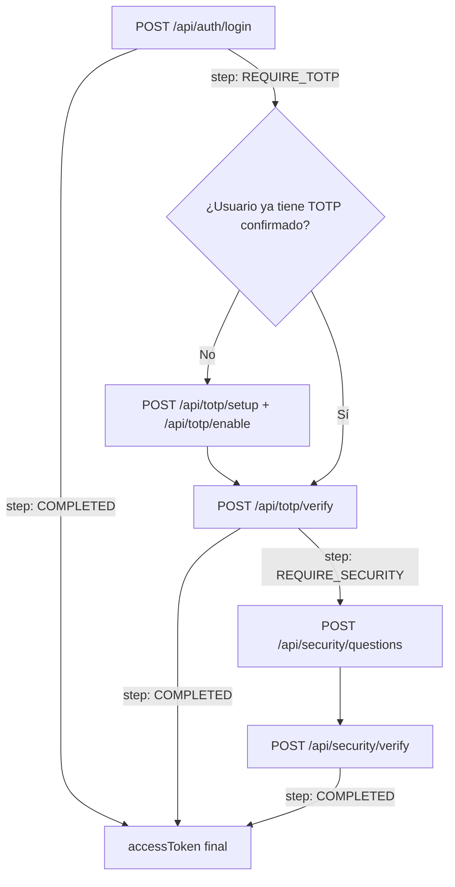

# Guía Frontend: Flujo Completo de Autenticación

Esta guía explica cómo debe integrar el frontend el login multi-factor de ValesMaster. No es un solo "método" de login: es una **cascada de hasta 3 factores** controlada por el campo `cantidadMfa` del rol del usuario, que el frontend descubre dinámicamente a partir de la respuesta del backend (no hay que hardcodear por rol).

Endpoints involucrados:

| Paso | Endpoint | Controller |
| :--- | :--- | :--- |
| 1. Password | `POST /api/auth/login` | [auth.controller.ts](../src/controllers/auth.controller.ts) → `loginPhaseOne` |
| 2. TOTP (setup, primera vez) | `POST /api/totp/setup`, `POST /api/totp/enable` | [totp.controller.ts](../src/controllers/totp.controller.ts) |
| 2. TOTP (login recurrente) | `POST /api/totp/verify` | [totp.controller.ts](../src/controllers/totp.controller.ts) → `verifyTotpLogin` |
| 3. Preguntas de seguridad | `POST /api/security/questions`, `POST /api/security/verify` | [security.controller.ts](../src/controllers/security.controller.ts) |

---

## 1. Concepto: máquina de estados por `step`

Cada respuesta exitosa de login trae un campo `step` que le dice al frontend qué pantalla mostrar a continuación. El frontend debe tratar el login como una máquina de estados, **no** como una sola llamada:



- `cantidadMfa === 1` → login termina en el paso 1.
- `cantidadMfa === 2` → login pasa por password + TOTP.
- `cantidadMfa === 3` → login pasa por password + TOTP + preguntas de seguridad.

El frontend **no necesita saber** de antemano cuántos factores tiene el rol: simplemente reacciona al `step` que devuelve cada respuesta.

---

## 2. Tipos de token que vas a manejar

| Token | Dónde se emite | Payload | Vigencia | Para qué sirve |
| :--- | :--- | :--- | :--- | :--- |
| `mfaToken` (REQUIRE_TOTP) | `loginPhaseOne` | `{ id, step: "REQUIRE_TOTP", mfaRequired }` | 5 min | Verificar TOTP (`/api/totp/verify`) **o** configurar TOTP por primera vez (`/api/totp/setup`, `/api/totp/enable`) |
| `mfaToken` (REQUIRE_SECURITY) | `verifyTotpLogin` | `{ id, step: "REQUIRE_SECURITY" }` | 5 min | Obtener y responder preguntas de seguridad (`/api/security/questions`, `/api/security/verify`) |
| `accessToken` | `loginPhaseOne`, `verifyTotpLogin` o `verifySecurityQuestions` (el que cierre el último factor) | `{ id, rol }` | 8 h | Sesión completa. Se envía en `Authorization: Bearer <accessToken>` |

**Importante:** el nombre `mfaToken` se reutiliza para dos propósitos distintos (TOTP pendiente vs. preguntas de seguridad pendientes). Para saber cuál es cuál, el frontend debe guardarse el `step` que vino junto con el token en la misma respuesta — no intentes inferirlo del token en sí.

Los 5 minutos de vigencia del `mfaToken` son cortos: diseña la UI para que el usuario entre directo a la pantalla de TOTP/preguntas apenas recibe el token, y maneja el caso de expiración (ver sección 5).

---

## 3. Paso 1 — Login con password

```http
POST /api/auth/login
Content-Type: application/json

{ "email": "juan.perez@example.com", "password": "PasswordSegura123!" }
```

Respuestas posibles:

- **`200` `step: "COMPLETED"`** → ya tenés `accessToken`, terminaste. Guardalo y andá directo a la app.
- **`200` `step: "REQUIRE_TOTP"`** → guardá `mfaToken` y and á al paso 2.
- **`401`** credenciales inválidas o contraseña incorrecta (mismo mensaje genérico por seguridad, no reveles cuál campo falló en la UI).
- **`403`** cuenta bloqueada (5 intentos fallidos → 15 min). Viene con `bloqueadoHasta` (ISO date) para mostrar countdown.
- **`500`** error interno.

---

## 4. Paso 2 — TOTP

### 4a. Primera vez (el usuario no tiene TOTP configurado)

Usá el **mismo `mfaToken`** que recibiste en el paso 1 (step `REQUIRE_TOTP`) como `Authorization: Bearer <mfaToken>` — no hace falta un accessToken completo para este bootstrap inicial:

```http
POST /api/totp/setup
Authorization: Bearer <mfaToken>
```
→ `200` con `{ qr, secret, secretId }`. Mostrá el `qr` (ya viene como data URL base64) para que el usuario lo escanee con Google Authenticator/Authy.

```http
POST /api/totp/enable
Authorization: Bearer <mfaToken>
Content-Type: application/json

{ "code": "845120" }
```
→ `200` confirma el TOTP. Después de esto, continuá al login normal de TOTP (4b) con el mismo `mfaToken` (todavía dentro de la ventana de 5 min) o hacé que el usuario vuelva a loguearse.

Cómo saber si es "primera vez": intentá `/api/totp/verify` (4b) directamente; si responde `400` con `"El usuario no tiene TOTP configurado."`, mandá al usuario al flujo de setup.

### 4b. Login recurrente (el usuario ya tiene TOTP confirmado)

```http
POST /api/totp/verify
Content-Type: application/json

{ "mfaToken": "<mfaToken del paso 1>", "code": "392014" }
```

Respuestas:
- **`200` `step: "COMPLETED"`** → `accessToken` final, listo.
- **`200` `step: "REQUIRE_SECURITY"`** → guardá el nuevo `mfaToken` (¡es otro token, para preguntas de seguridad!) y andá al paso 3.
- **`400`** usuario sin TOTP configurado → mandalo a 4a.
- **`401`** código incorrecto, o el `mfaToken` es inválido/expiró (mensaje distinto según el caso — ver sección 5).
- **`404`** usuario no encontrado.

---

## 5. Paso 3 — Preguntas de seguridad (solo `cantidadMfa === 3`)

```http
POST /api/security/questions
Content-Type: application/json

{ "mfaToken": "<mfaToken del paso 2>" }
```
→ `200` con `{ questions: [{ id, question }] }` — pedí una respuesta por cada una, **en el mismo orden**.

```http
POST /api/security/verify
Content-Type: application/json

{ "mfaToken": "<mismo mfaToken>", "answers": ["respuesta1", "respuesta2"] }
```

Respuestas:
- **`200` `step: "COMPLETED"`** → `accessToken` final.
- **`400`** faltan respuestas, no coincide la cantidad, o el usuario no tiene preguntas configuradas.
- **`401`** respuestas incorrectas, o `mfaToken` inválido/expirado.
- **`404`** usuario no encontrado.

---

## 6. Manejo de errores — igual en los 3 factores

Después del fix aplicado en agosto 2026, los tres controllers (`auth`, `totp`, `security`) distinguen de forma consistente:

| Status | Significado | Qué debe hacer el frontend |
| :--- | :--- | :--- |
| `400` | Falta un campo obligatorio en el body (`mfaToken`, `code`, `answers`, etc.) | Error de validación de formulario, no reinicies el flujo |
| `401` | Token de MFA/sesión inválido **o expirado** (`TokenExpiredError`/`JsonWebTokenError`), o credenciales/código/respuestas incorrectas | Si es token expirado (ventana de 5 min agotada): **reiniciar el login desde el paso 1**. Si es código/respuesta incorrecta: dejar reintentar en la misma pantalla |
| `403` | Cuenta bloqueada temporalmente | Mostrar `bloqueadoHasta` |
| `404` | Usuario no encontrado (normalmente el `id` del token ya no existe) | Reiniciar el login desde el paso 1 |
| `409` | Recurso duplicado (solo en `/api/auth/register`) / TOTP ya configurado (`/api/totp/setup`) | Mostrar mensaje específico |
| `500` | Error real de servidor | Mensaje genérico de "intenta más tarde" |

El body de error siempre tiene la forma `{ "message": "..." }` en estos tres controllers — podés parsear `message` de forma uniforme para toda la UI de auth (no aplica al resto de la API, que usa shapes distintos: `{success, data}` en `gerentes`, `{message, data}` en `solicitudes`).

**Nota práctica:** como el `mfaToken` dura solo 5 minutos, vas a ver `401` por expiración con cierta frecuencia si el usuario tarda en escribir el código. Diseñá la pantalla de TOTP/preguntas con un mensaje claro tipo "tu sesión de verificación expiró, volvé a iniciar sesión" en vez de tratarlo como error genérico.

---

## 7. Sesión completa

Una vez que tenés el `accessToken` (venga del paso 1, 2 o 3), guardalo (ej. memoria + refresh vía login, no hay refresh token todavía) y mandalo en cada request protegida:

```http
Authorization: Bearer <accessToken>
```

Expira a las 8 horas sin mecanismo de refresh — al recibir `401` en cualquier endpoint protegido con este token, mandá al usuario de vuelta al login completo.

---

## 8. Pseudocódigo de referencia (frontend)

```ts
async function login(email: string, password: string) {
  const res = await api.post('/api/auth/login', { email, password });

  if (res.data.step === 'COMPLETED') return saveSession(res.data.accessToken);
  if (res.data.step === 'REQUIRE_TOTP') return goToTotpScreen(res.data.mfaToken);
}

async function submitTotp(mfaToken: string, code: string) {
  try {
    const res = await api.post('/api/totp/verify', { mfaToken, code });
    if (res.data.step === 'COMPLETED') return saveSession(res.data.accessToken);
    if (res.data.step === 'REQUIRE_SECURITY') return goToSecurityScreen(res.data.mfaToken);
  } catch (err) {
    if (err.response?.status === 400) return goToTotpSetupScreen(mfaToken); // no configurado aún
    if (err.response?.status === 401) return handleAuthError(err.response.data.message); // código malo o token vencido
  }
}

async function submitSecurityAnswers(mfaToken: string, answers: string[]) {
  const res = await api.post('/api/security/verify', { mfaToken, answers });
  if (res.data.step === 'COMPLETED') return saveSession(res.data.accessToken);
}
```

---

## 9. Limitaciones actuales a tener en cuenta al planear el frontend

- Fuera de `/api/totp/setup` y `/api/totp/enable`, **ninguna otra ruta del backend valida el `accessToken`** todavía (rutas de `gerentes` y `solicitudes` son anónimas). No asumas que mandar el header alcanza para "proteger" esas pantallas del lado del cliente únicamente.
- No hay refresh token: a las 8h el usuario tiene que volver a loguearse desde cero.
- `POST /api/auth/register` está abierto sin autenticación (pensado solo para pruebas) — no lo expongas en la UI de producción.
- CORS del backend no incluye `PATCH` en `methods` ([index.ts](../src/index.ts)), lo que rompe el preflight de `PATCH /api/gerentes/desactivar/empleado/:id` si lo llamás desde el browser. Hay que corregirlo en el backend antes de usar ese endpoint desde el frontend.
